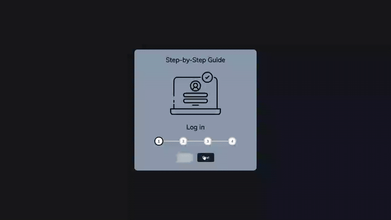

# Progress Steps - Interactive Guide

A dynamic step-by-step progress indicator with visual feedback built with JavaScript.

## Preview

## Info
**Tech:** HTML, CSS (Custom Properties, Flexbox), JavaScript  
**Focus:** Dynamic DOM manipulation, state management  

## Features
- Interactive progress bar that fills as you advance through steps
- Dynamic step numbering with active state indicators
- Context-aware content with images and descriptions for each step
- Disabled button states to prevent invalid navigation
- Smooth transitions and visual feedback

## Improvements Made
- **Polished styling** – Refined overall design with shadows, borders, and modern themes
- **Dynamic content** – Added step images and descriptive text that changes with progress
- **Better user experience** – Added visual container with rounded corners and proper spacing
- **Improved styling** – Enhanced button interactions and hover states

## What I Learned
- Dynamic DOM manipulation and updating elements in real-time
- Array methods (forEach) for managing state across multiple elements
- CSS custom properties for consistent theming
- Button state management based on current progress

## Links
[View Project](https://codepen.io/MahmoudMa2002/full/raVwYZZ/) | [Back to Main Projects List](../README.md)