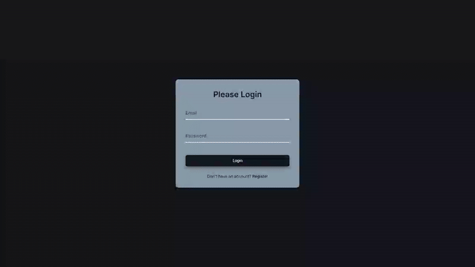

# Form Input Wave - Login/Register System

An animated form interface with floating label effects and smooth page transitions between login and registration forms.

## Preview

## Info
**Tech:** HTML, CSS (Transitions), JavaScript  
**Focus:** String manipulation, dynamic animations, form handling  

## Features
- Animated floating labels with wave effect on individual letters
- Smooth transitions between login and registration pages
- Form validation states that trigger label animations
- Staggered letter animations with calculated transition delays
- Modern UI design with hover effects and micro-interactions

## Improvements Made
- **Enhanced visual design** – Applied modern dark theme with Inter font and improved styling
- **Dynamic page system** – Added complete login/register page switching functionality
- **Enhanced styling** – Applied modern design with better colors and spacing

## What I Learned
- String manipulation by splitting text into individual characters
- Dynamic HTML generation with JavaScript for animation
- CSS transition delays for staggered animations
- Page switching logic with class-based visibility
- Event prevention with preventDefault() for link behavior

## Links
[View Project](#) | [Back to Main Projects List](../README.md)