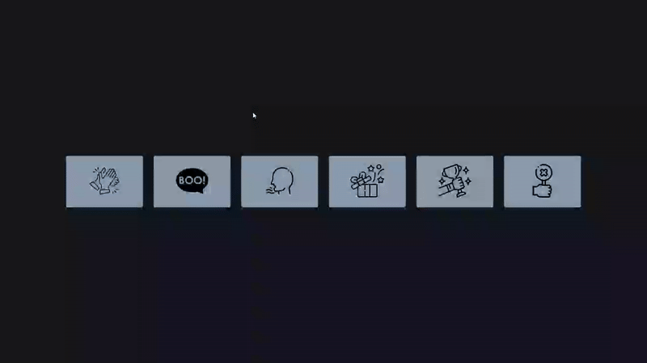

# Sound Board - Interactive Audio Player

An interactive sound board application that dynamically generates buttons with images and plays corresponding audio files when clicked.

## Preview

## Info
**Tech:** HTML, CSS (Transitions, Transforms), JavaScript  
**Focus:** DOM manipulation, Audio API, dynamic generation  

## Features
- Dynamic button generation from JavaScript arrays
- Click-to-play audio functionality with automatic stopping of other sounds
- Hover effects with smooth CSS transitions and transform animations
- Image-based button design with custom styling
- Responsive layout that adapts to different screen sizes

## Improvements Made
- **Enhanced visual design** – Applied dark theme with custom color scheme and images
- **Interactive feedback** – Added hover effects with opacity changes and smooth transforms

## What I Learned
- DOM manipulation with createElement() and appendChild()
- HTML5 Audio API with play(), pause(), and currentTime controls
- Event delegation for dynamically created elements
- Array iteration with for loops to generate UI elements
- Audio state management to prevent overlapping playback

## Links
[View Project](https://codepen.io/MahmoudMa2002/full/gbpRoVK) | [Back to Main Projects List](../README.md)