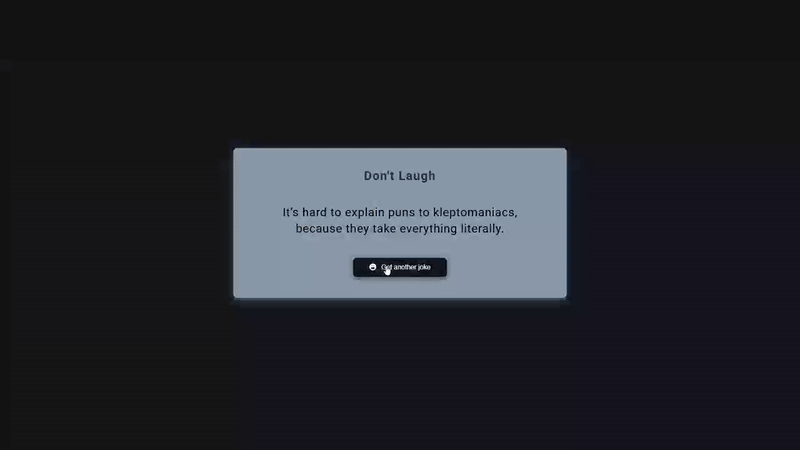

# Dad Jokes Generator - API-Powered Humor App

A dynamic joke generator that fetches random dad jokes from an external API and displays them with smooth loading animations.

## Preview

## Info
**Tech:** HTML, CSS (Animations, Transitions), JavaScript (Async/Await, Axios)  
**Focus:** API integration, asynchronous operations  

## Features
- Automatic joke loading on page load
- Click-to-generate new jokes with loading feedback
- Smooth CSS transitions and hover effects
- Error handling for failed API requests
- Responsive design with mobile-optimized styling
- Clean, modern card-based interface with subtle shadows

## Improvements Made
- **Enhanced visual design** – Applied modern card-based layout with custom color scheme
- **Smooth animations** – Added hover effects and loading animations
- **Better styling** – Enhanced typography and spacing for better readability
- **Responsive design** – Implemented mobile-optimized layouts and font sizing

## What I Learned
- Async/await functions for API calls
- Axios HTTP client for GET requests with headers
- REST API integration and JSON response handling
- Error handling with try/catch blocks
- Loading states for user feedback during async operations

## Links
[View Project](https://codepen.io/MahmoudMa2002/full/KwpqQwO/) | [Back to Main Projects List](../README.md)