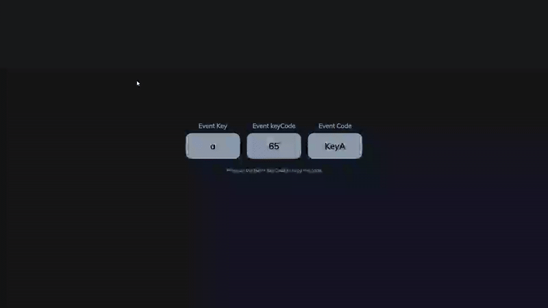

# Event KeyCodes - Interactive Key Detection Tool

A dynamic key detection application that displays key information and allows users to copy key codes when any keyboard key is pressed.

## Preview

## Info
**Tech:** HTML, CSS (Transitions, Transforms), JavaScript  
**Focus:** Event handling, Clipboard API, dynamic content  

## Features
- Real-time key detection displaying key name, keyCode, and code values
- Click-to-copy functionality for key codes with visual confirmation
- Hover effects with smooth CSS transitions and transform animations
- Special handling for space key display
- Responsive layout that adapts to mobile devices
- Clean, modern interface with rounded key displays

## Improvements Made
- **Interactive feedback** – Added hover effects and copy confirmation with smooth transitions
- **Copy functionality** – Added click-to-copy feature with visual feedback and success messages
- **Responsive design** – Enhanced mobile layout with stacked key display and optimized spacing

## What I Learned
- Window-level keydown event listeners for global key detection
- Event object properties (key, keyCode, code)
- Clipboard API with navigator.clipboard.writeText()
- Dynamic HTML generation with template literals
- CSS state management with class toggling

## Links
[View Project](https://codepen.io/MahmoudMa2002/full/RNPgQjY) | [Back to Main Projects List](../README.md)