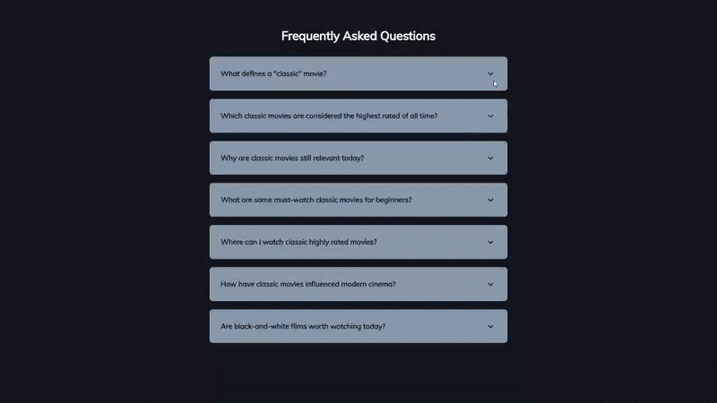

# FAQ Collapse - Interactive Accordion Component

A dynamic FAQ accordion system that allows users to expand and collapse question sections with smooth animations and visual feedback.

## Preview

## Info
**Tech:** HTML, CSS (Transitions, Pseudo-elements), JavaScript  
**Focus:** Accordion UI patterns, toggle functionality  

## Features
- Click-to-expand/collapse functionality for each FAQ section
- Smooth CSS transitions with background color changes when active
- Dynamic icon switching between chevron-down and times icons
- Decorative background elements that appear when sections are expanded
- Responsive design with mobile-optimized layouts
- Clean, modern accordion interface with subtle shadows and hover effects

## Improvements Made
- **Enhanced visual design** – Applied modern card-based layout with custom color scheme and shadows
- **Interactive elements** – Added hover effects and icon transitions for better user feedback
- **Responsive design** – Implemented mobile-optimized spacing and typography adjustments

## What I Learned
- CSS transitions for smooth expand/collapse animations
- Toggle functionality with classList.toggle()
- Event delegation using for...of loops
- CSS pseudo-elements (::before, ::after) for decorative icons
- Accordion UI patterns with proper accessibility

## Links
[View Project](https://codepen.io/MahmoudMa2002/full/vEOZdvv/) | [Back to Main Projects List](../README.md)