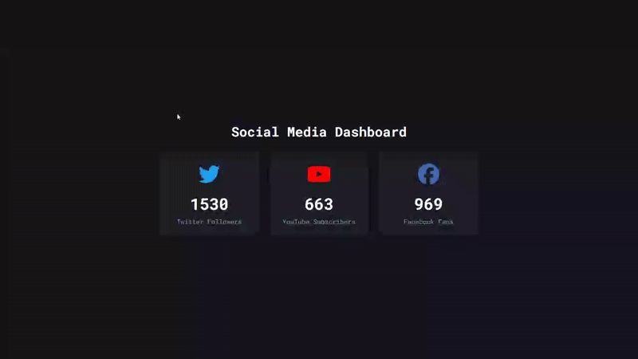

# Social Stats Counter - Animated Number Counter Component

A dynamic social media dashboard that displays animated counters for different platforms with smooth incrementing animations and modern card-based design.

## Preview

## Info
**Tech:** HTML, CSS (Flexbox, Custom Properties), JavaScript  
**Focus:** Recursive functions, data attributes, counter animations  

## Features
- Animated counter increment from 0 to target values with realistic timing
- Individual social media platform branding with authentic brand colors
- Smooth hover animations with card lift effects
- Responsive grid layout that adapts to different screen sizes

## Improvements Made
- **Interactive elements** – Added hover effects with smooth transform animations
- **Responsive design** – Implemented mobile-optimized layouts that stack vertically on smaller screens

## What I Learned
- Recursive functions using setTimeout for smooth counting animations
- Data attributes for storing target values and accessing with getAttribute()
- Math.ceil() for rounding up decimal increments
- CSS custom properties for consistent theming
- Flexbox layouts with flex-wrap and gap properties

## Links
[View Project](https://codepen.io/MahmoudMa2002/full/dPoRmPw) | [Back to Main Projects List](../README.md)