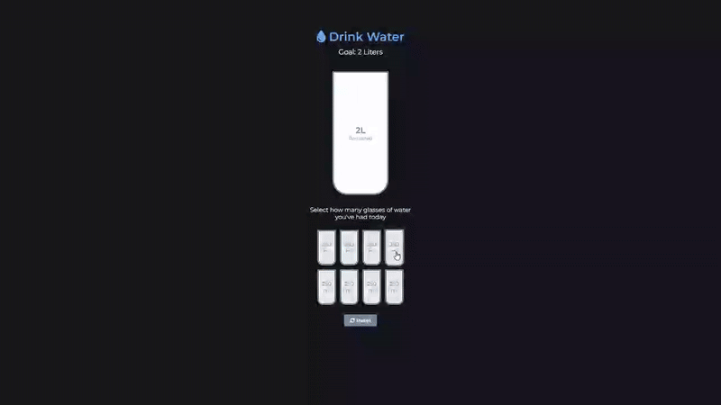

# Hydration Tracker - Interactive Water Intake Monitor

A visual water consumption tracker that helps users monitor their daily hydration goals with an interactive cup interface.

## Preview

## Info
**Tech:** HTML, CSS (Custom Properties, Transitions), JavaScript  
**Focus:** DOM manipulation, conditional logic, dynamic styling  

## Features
- Click-to-fill functionality for individual 250ml water cups
- Dynamic progress visualization with animated height changes in main cup
- Real-time calculation of remaining water intake and percentage completed
- Visual feedback with color changes when cups are filled
- Unit conversion between liters and milliliters for small remaining amounts

## Improvements Made
- **Interactive elements** – Added hover effects on small cups with scaling animations
- **UX Improvements** – Switched to milliliters for small remaining amounts, added a reset button and more minor imporvements

## What I Learned
- Dynamic height manipulation for creating visual fill effects
- CSS visibility control using visibility and height properties
- Event delegation with forEach and index parameters
- Conditional logic for interactive state management
- Unit conversion between milliliters and liters

## Links
[View Project](https://codepen.io/MahmoudMa2002/full/JodJLYB) | [Back to Main Projects List](../README.md)