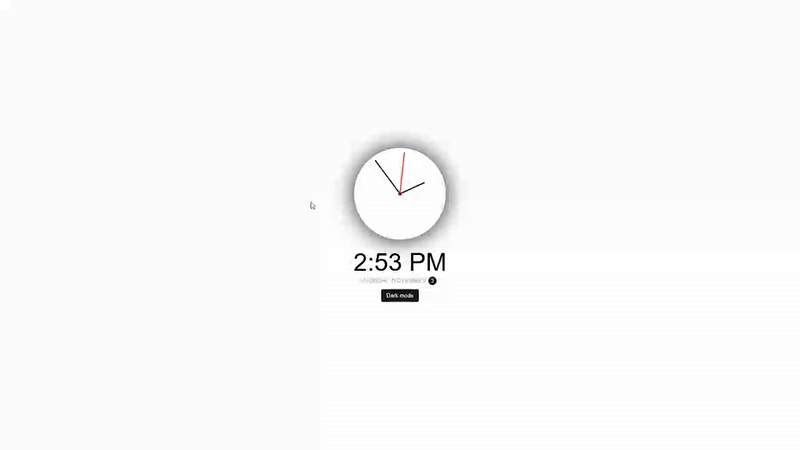

# Theme Clock - Analog Clock with Dark Mode Toggle

A real-time analog clock with smooth needle animations and a dark/light theme toggle functionality.

## Preview

## Info
**Tech:** HTML, CSS (Custom Properties, Transforms), JavaScript  
**Focus:** Date manipulation, CSS transforms, theme switching  

## Features
- Real-time analog clock display with hour, minute, and second hands
- Digital time display in 12-hour format with AM/PM indicator
- Current date display with day of week and formatted date
- Dark and light theme toggle with smooth transitions
- Smooth needle animations that update every second

## Improvements Made
- **Enhanced UI** – Added circular border around clock and hover effect to toggle button for improved user experience

## What I Learned
- Date object manipulation to extract hours, minutes, seconds, and date information
- Mathematical scaling to convert time values to degrees for needle rotation
- CSS custom properties for dynamic theme switching
- Transform operations with proper transform origins for needle positioning
- Real-time updates using setInterval for continuous clock updates

## Links
[View Project](https://codepen.io/MahmoudMa2002/full/NPqgYov) | [Back to Main Projects List](../README.md)