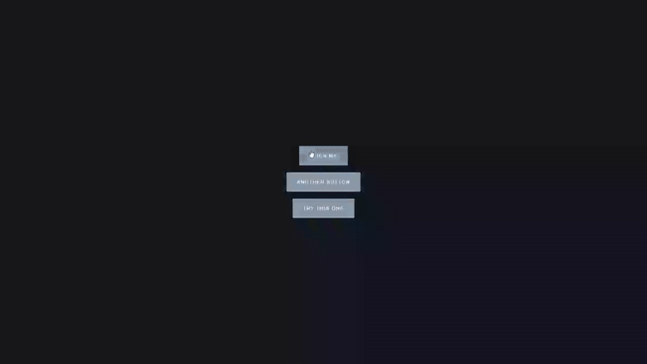

# Button Ripple Effect - Interactive Button Animation

Interactive buttons with Material Design-inspired ripple effects that animate from the exact click position.

## Preview

## Info
**Tech:** HTML, CSS (Keyframe Animations), JavaScript  
**Focus:** Mouse event handling, dynamic element creation, CSS animations  

## Features
- Multiple interactive buttons with individual ripple effects
- Ripple animation originates from exact mouse click position
- Smooth scaling animation with fade-out effect using CSS keyframes
- Automatic cleanup of animation elements after completion
- Hover effects with subtle scaling and color transitions

## Improvements Made
- **Minimal changes** – Simple project with few modifications to the original design and animations

## What I Learned
- Mouse event coordinates using clientX and clientY properties
- Element positioning with offsetTop and offsetLeft for relative calculations
- Dynamic element creation and manipulation with JavaScript
- CSS keyframe animations with transform scaling and opacity transitions
- Event loop management with setTimeout for element cleanup

## Links
[View Project](https://codepen.io/MahmoudMa2002/full/YPXQaoy) | [Back to Main Projects List](../README.md)