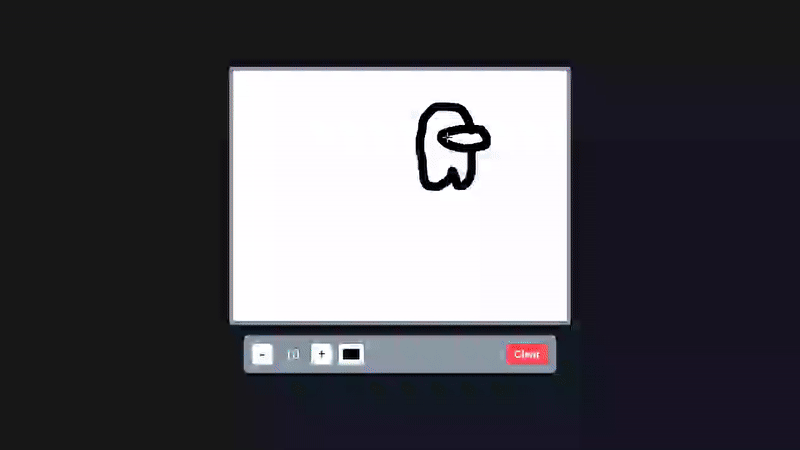

# Drawing App - HTML5 Canvas Drawing Tool

An interactive web-based drawing application with adjustable brush sizes, color selection, and drawing capabilities.

## Preview

## Info
**Tech:** HTML, CSS (Flexbox, Media Queries), JavaScript, Canvas API  
**Focus:** HTML5 Canvas drawing, mouse event handling, dynamic styling  

## Features
- Smooth freehand drawing with mouse input
- Adjustable brush size with increase/decrease buttons (5-50 pixel range)
- Color picker for custom drawing colors
- Clear canvas functionality to reset the drawing surface
- Responsive design that adapts to different screen sizes
- Smooth line interpolation between mouse positions

## Improvements Made
- **Responsive canvas design** – Added dynamic canvas resizing that adapts to window size while maintaining aspect ratio
- **Enhanced UI design** – Implemented modern toolbox with improved spacing and styling
- **Interactive button effects** – Added hover animations with translateY transforms and box shadows
- **Improved layout structure** – Enhanced toolbox layout with flexbox and proper gap spacing
- **Mobile responsiveness** – Added media queries for better mobile experience with flexible canvas sizing

## What I Learned
- HTML5 Canvas API for 2D drawing operations and path manipulation
- Mouse event handling for capturing movements, clicks, and position coordinates
- Canvas drawing methods (beginPath, arc, moveTo, lineTo, stroke, fill)
- Event coordinate systems with offsetX and offsetY for accurate cursor tracking
- Canvas state management with boolean flags and coordinate tracking

## Links
[View Project](https://codepen.io/MahmoudMa2002/full/KwpqRde) | [Back to Main Projects List](../README.md)