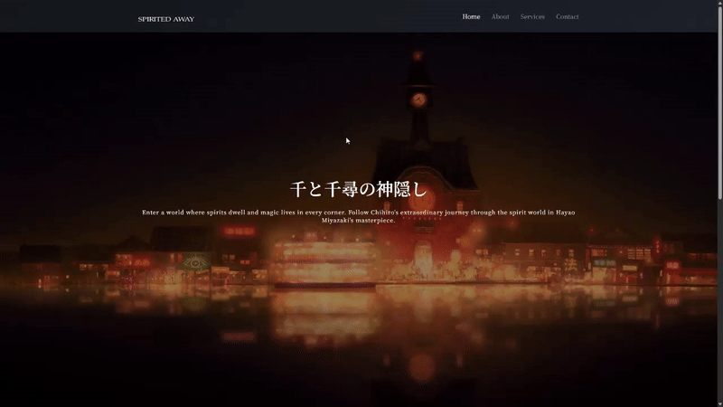

# Sticky Navigation - Responsive Navigation Bar with Scroll Effects

A dynamic navigation bar that transforms when scrolling, featuring smooth transitions and responsive design with themed content about Studio Ghibli's Spirited Away.

## Preview

## Info
**Tech:** HTML, CSS (Transitions, Gradients), JavaScript  
**Focus:** Scroll event handling, dynamic class manipulation, fixed positioning  

## Features
- Sticky navigation that activates after scrolling past the hero section
- Smooth scaling animation for logo during navigation state changes
- Gradient background effects that enhance visual appeal
- Responsive design with mobile-friendly navigation layout
- Content sections with glassmorphism styling and proper typography
- Hero section with full-screen background and overlay effects

## Improvements Made
- **Complete content overhaul** – Transformed generic demo into a themed experience about Studio Ghibli's "Spirited Away" with meaningful content
- **Enhanced visual design** – Implemented gradient backgrounds, hero sections with overlay effects, and improved typography using "Spirited Away" inspired fonts
- **Advanced layout structure** – Added content sections with proper spacing and visual hierarchy for better readability
- **Professional styling** – Enhanced navigation with gradient backgrounds, smooth scaling effects for the logo, and refined color schemes
- **Improved responsiveness** – Added comprehensive media queries and flexible layouts for better mobile experience

## What I Learned
- Scroll event handling using window scroll events and scrollY property
- Dynamic class manipulation based on scroll position for state changes
- Fixed positioning with proper z-index layering
- CSS transitions for smooth animations between navigation states
- Element offset properties using offsetHeight for precise scroll trigger points

## Links
[View Project](https://codepen.io/MahmoudMa2002/full/WbvOJYY) | [Back to Main Projects List](../README.md)