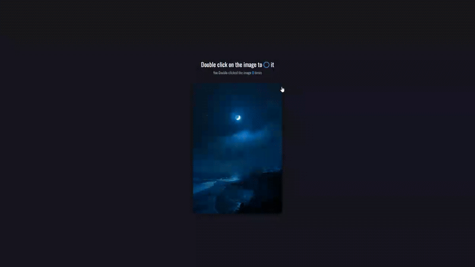

# Double Click Effect - Interactive Circle Animation

A smooth interactive effect that creates animated circle icons when double-clicking on an image, featuring real-time click counting and dynamic positioning with fade-out animations.

## Preview

## Info
**Tech:** HTML, CSS (Keyframe Animations, Custom Properties), JavaScript  
**Focus:** Event handling, coordinate calculations, dynamic DOM manipulation  

## Features
- Interactive double-click detection with precise coordinate tracking
- Real-time click counter that increments with each double-click
- Smooth circle animation with grow effect that scales from 0 to 8x size with opacity fade
- Dynamic positioning system that places circles exactly at click location
- Automatic cleanup with 1-second timeout after animation completion
- Responsive image container with hover effects and professional styling

## Improvements Made
- **Improved image styling** – Added hover effects with smooth transforms and elevated shadow effects
- **Polished styling** – Refined overall design with shadows, borders, and modern themes

## What I Learned
- Event handling using addEventListener for double-click events
- DOM manipulation for creating and dynamically adding elements with appendChild and remove
- Coordinate calculations converting global mouse coordinates to relative positions
- CSS animation integration with JavaScript-triggered elements
- Timeout management using setTimeout for automatic element cleanup
- Position calculations using offset properties for precise placement

## Links
[View Project](https://codepen.io/MahmoudMa2002/full/ZYGyRzY) | [Back to Main Projects List](../README.md)