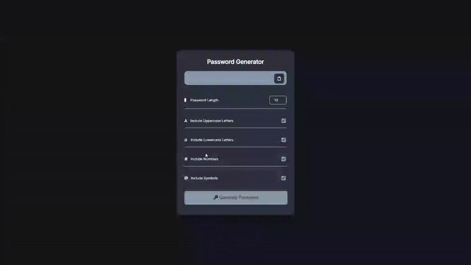

# Password Generator - Secure Password Creation Tool

A robust password generator with customizable character sets and clipboard functionality, featuring real-time generation with adjustable length and multiple character type options for enhanced security.

## Preview

## Info
**Tech:** HTML, CSS (Custom Properties), JavaScript, Clipboard API  
**Focus:** Character set management, form validation, algorithm design  

## Features
- Customizable password length ranging from 4 to 25 characters with validation
- Multiple character set options (uppercase, lowercase, numbers, symbols)
- Password generation algorithm ensuring balanced character distribution
- One-click clipboard functionality with user feedback via alert notifications
- Real-time password generation with immediate visual feedback

## Improvements Made
- **Enhanced visual design** – Implemented dark theme with custom CSS variables and professional container styling
- **Improved user interface** – Added FontAwesome icons for better visual hierarchy and intuitive control identification

## What I Learned
- Character set management using String.fromCharCode() with ASCII values
- Clipboard API integration with navigator.clipboard.writeText()
- Form validation logic processing checkbox states and numeric inputs
- Algorithm design for balanced password generation with all selected character types
- Event-driven programming for handling multiple user inputs and button clicks

## Links
[View Project](https://codepen.io/MahmoudMa2002/full/PwqjBZo) | [Back to Main Projects List](../README.md)