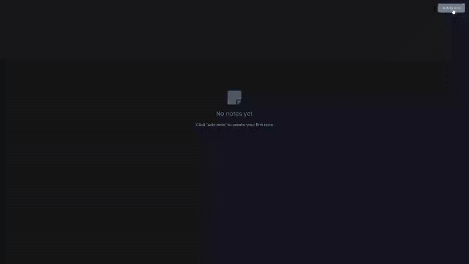

# Notes App - Markdown-Powered Note Taking

A feature-rich note-taking application with markdown support and local storage persistence, featuring real-time preview, edit/view modes, and an intuitive empty state interface for enhanced user experience.

## Preview

## Info
**Tech:** HTML, CSS (Custom Properties, Grid), JavaScript, Marked.js, Local Storage  
**Focus:** Local storage management, markdown integration, dynamic DOM manipulation  

## Features
- Real-time markdown editing with instant preview rendering using marked.js library
- Persistent local storage that automatically saves and restores notes across sessions
- Individual note management with edit and delete functionality including confirmation prompts
- Responsive card-based layout that adapts to different screen sizes
- Empty state interface that guides new users with clear call-to-action messaging

## Improvements Made
- **Enhanced visual design** – Added dark theme with custom CSS variables and modern color palette
- **Improved user experience** – Added empty state with icon, heading, and description text for better onboarding

## What I Learned
- Local storage management using localStorage with JSON serialization for data persistence
- Markdown integration with marked.js library for real-time parsing and HTML rendering
- Dynamic DOM manipulation for creating, inserting, and removing note elements
- Toggle state management implementing edit/view mode switching with CSS classes
- Event delegation for handling multiple dynamic elements with individual listeners
- Conditional rendering managing empty state visibility based on application content

## Links
[View Project](https://codepen.io/MahmoudMa2002/full/raVwrLp) | [Back to Main Projects List](../README.md)