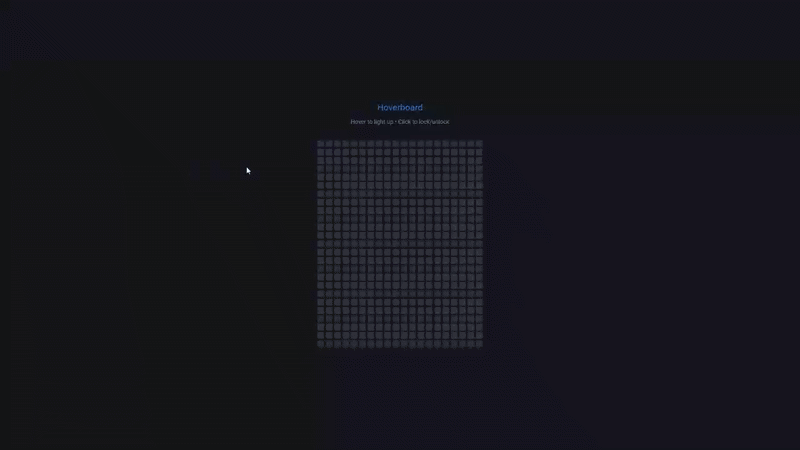

# Hoverboard - Interactive Color Grid

An interactive grid of squares that change colors on hover, featuring toggleable drawing mode and smooth color transitions with random color generation.

## Preview

## Info
**Tech:** HTML, CSS (Transitions), JavaScript  
**Focus:** Event handling, color generation, grid manipulation  

## Features
- Interactive grid of 500+ squares that respond to mouse hover
- Random color generation using HSL color space for vibrant effects
- Toggleable drawing mode - click squares to lock colors in place
- Smooth color transitions when hovering and leaving squares
- Automatic color fade-out after 1 second on mouseout
- Responsive grid layout with consistent square sizing

## Improvements Made
- **Toggleable drawing mode** – Added click functionality to lock colors, allowing users to draw patterns
- **Enhanced visual design** – Implemented dark theme with better color contrast
- **Improved color palette** – Refined random color generation for more vibrant results

## What I Learned
- Event handling with mouseover and mouseout listeners
- Random color generation using HSL values
- Grid layout creation with dynamic element generation
- Toggle state management for interactive drawing
- CSS transitions for smooth color changes
- setTimeout for delayed color removal

## Links
[View Project](https://codepen.io/MahmoudMa2002/full/raVwryJ) | [Back to Main Projects List](../README.md)