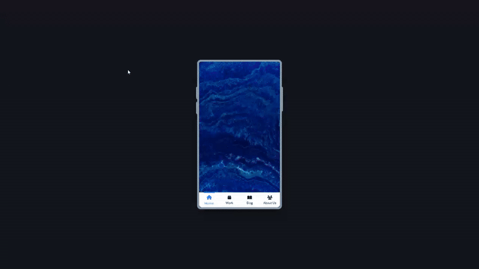

# Mobile Navigation - Phone UI Showcase

An interactive mobile phone interface with animated navigation menu, featuring smooth transitions, image gallery, and realistic phone mockup design.

## Preview

## Info
**Tech:** HTML, CSS (Transforms, Transitions), JavaScript  
**Focus:** Mobile UI design, navigation animations, transform effects  

## Features
- Realistic phone mockup with rounded corners and shadow effects
- Animated hamburger menu that transforms into close icon
- Smooth circular navigation expansion animation
- Image gallery showcasing content within phone interface
- Toggle functionality between open and closed menu states
- Responsive navigation with rotation and scale transforms

## Improvements Made
- **Phone UI mockup** – Created a mobile device interface with proper dimensions
- **Enhanced visual effects** – Added hover effects and fade transitions for better interactivity
- **Polished styling** – Refined overall design with shadows, borders, and modern aesthetics

## What I Learned
- CSS transform combinations for complex animations
- Creating realistic device mockups with CSS
- Circular menu expansion with transform-origin
- Toggle state management with class switching
- Layered UI elements with z-index control
- Icon animation transitions between states

## Links
[View Project](https://codepen.io/MahmoudMa2002/full/jEPwpLm) | [Back to Main Projects List](../README.md)