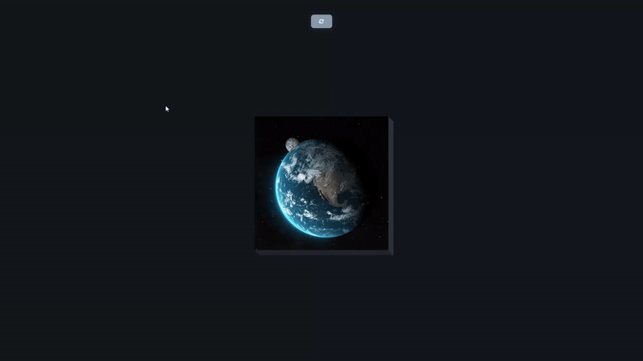

# 3D Boxes - Rotating Image Grid

An interactive 3D grid of rotating boxes that transform between a complete image and scattered animated cubes, featuring smooth transitions and hover effects.

## Preview

## Info
**Tech:** HTML, CSS (3D Transforms, Animations), JavaScript  
**Focus:** 3D transformations, perspective effects, grid manipulation  

## Features
- Toggle between unified image view and 3D rotating box grid
- Smooth 3D rotation animations with perspective effects
- Grid of boxes that each display a portion of the full image
- Dynamic transition between flat and rotated states
- Responsive layout with proper aspect ratio maintenance
- Button-triggered transformation with smooth transitions

## Improvements Made
- **Hover effects** – Added interactive hover states for individual boxes
- **Enhanced animations** – Improved rotation timing and easing functions
- **Polished styling** – Refined overall design with shadows, borders, and modern themes

## What I Learned
- CSS 3D transforms with rotateY and perspective
- Creating image grids with background-position
- Managing transform-origin for rotation effects
- Toggle functionality for 3D transformations
- CSS perspective and transform-style properties
- Dynamic class management for animation states

## Links
[View Project](https://codepen.io/MahmoudMa2002/full/PwqKLLP) | [Back to Main Projects List](../README.md)