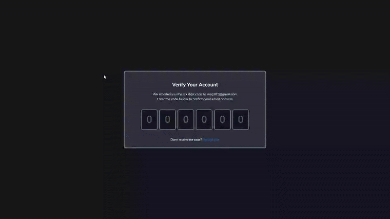

# Verify Account UI - Code Input Interface

A clean verification code input interface with automatic focus progression and keyboard navigation, featuring modern styling and smooth user experience.

## Preview

## Info
**Tech:** HTML, CSS (Transitions), JavaScript  
**Focus:** Input handling, keyboard navigation, form UX  

## Features
- Six-digit verification code input with individual fields
- Automatic focus progression to next input on digit entry
- Backspace navigation that moves focus to previous field
- Paste support for quick code entry
- Number-only input validation
- Clean, modern card-based design with centered layout

## Improvements Made
- **Enhanced styling** – Applied modern design with better colors and spacing
- **Visual polish** – Improved input field design and overall design

## What I Learned
- Input event handling and focus management
- Keyboard event detection for navigation
- Restricting input to specific character types
- Automatic focus progression between form fields
- Creating intuitive multi-input interfaces
- Form UX patterns for verification codes

## Links
[View Project](https://codepen.io/MahmoudMa2002/full/bNdoVqN) | [Back to Main Projects List](../README.md)