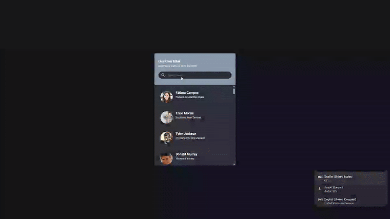

# Live User Filter - Searchable User List

A dynamic user directory that fetches random user data from an API and provides real-time search filtering functionality with clean card-based design.

## Preview

## Info
**Tech:** HTML, CSS (Flexbox), JavaScript (Fetch API)  
**Focus:** API integration, search filtering, real-time updates  

## Features
- Fetches 50 random users from randomuser.me API
- Real-time search filtering by name or location
- User cards displaying profile pictures, names, and locations
- Instant results as user types in search field
- Responsive list layout with hover effects
- Loading state while fetching data

## Improvements Made
- **Enhanced styling** – Applied cleaner design with improved spacing and colors

## What I Learned
- Fetch API for retrieving external data
- Array filtering methods for search functionality
- Real-time input event handling
- DOM manipulation for dynamic list updates
- API data parsing and display
- Case-insensitive string matching with includes()

## Links
[View Project](https://codepen.io/MahmoudMa2002/full/ogXGjVV) | [Back to Main Projects List](../README.md)