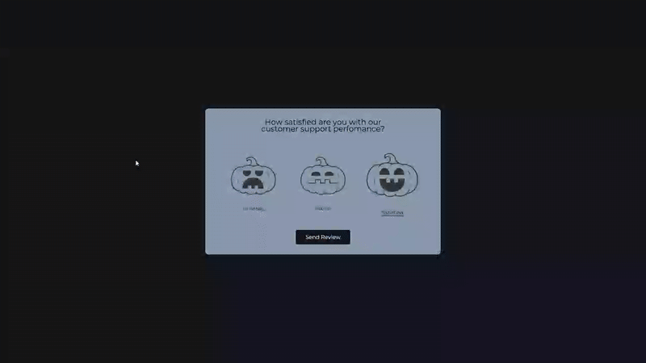

# Feedback UI Design - User Satisfaction Survey

An interactive user feedback interface with emoji-based satisfaction ratings, featuring smooth animations and a thank you confirmation screen.

## Preview

## Info
**Tech:** HTML, CSS (Transitions, Animations), JavaScript  
**Focus:** Form UX, state management, visual feedback  

## Features
- Three-level satisfaction rating system (Unhappy, Neutral, Satisfied)
- Interactive emoji icons with hover and active states
- Smooth transition to thank you screen after submission
- Visual feedback with scale and color transitions
- Clean card-based design with centered layout
- Single-selection rating system with active state highlighting

## Improvements Made
- **Enhanced styling** – Applied modern design with better colors and spacing
- **Improved animations** – Added smoother transitions and hover effects
- **Halloween theming** – Integrated themed images for seasonal appeal

## What I Learned
- Radio button alternatives with custom styling
- State management for selected options
- DOM manipulation for screen transitions
- Event handling for form submissions
- CSS transforms for interactive feedback
- Creating intuitive rating interfaces

## Links
[View Project](https://codepen.io/MahmoudMa2002/full/GgJOJOO) | [Back to Main Projects List](../README.md)