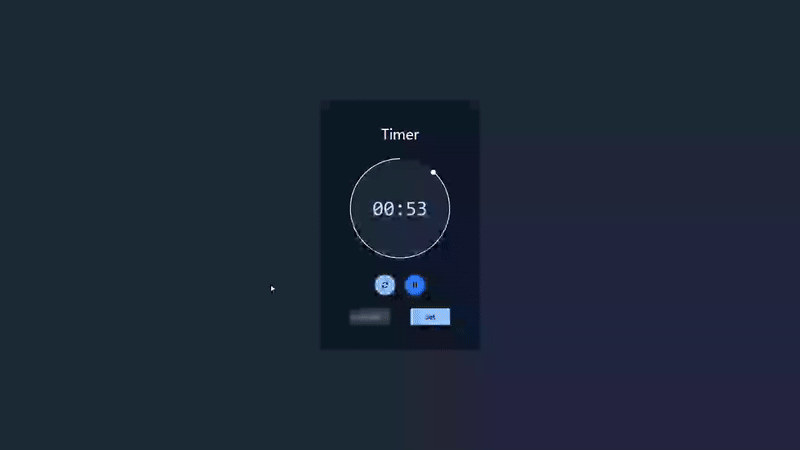

# Simple Timer - Countdown Application

A customizable countdown timer built with Tailwind CSS, featuring user-defined time settings, start/pause/reset controls, and clean modern interface.

## Preview

## Info
**Tech:** HTML, Tailwind CSS, JavaScript  
**Focus:** Timer logic, interval management, Tailwind styling  

## Features
- Customizable timer with user-defined hours, minutes, and seconds
- Start, pause, and reset controls for timer management
- Real-time countdown display with formatted time
- Visual feedback with button state changes
- Responsive design with Tailwind utility classes
- Clean, modern interface with proper spacing and typography

## Improvements Made
- **Custom time setting** – Added ability for users to set their own countdown duration

## What I Learned
- Tailwind CSS utility classes for rapid styling
- Timer logic with setInterval and clearInterval
- Time formatting and countdown calculations
- Input validation for time values
- State management for play/pause functionality
- Building responsive interfaces with Tailwind

## Links
[View Project](https://codepen.io/MahmoudMa2002/full/WbvJEpW) | [Back to Main Projects List](../README.md)